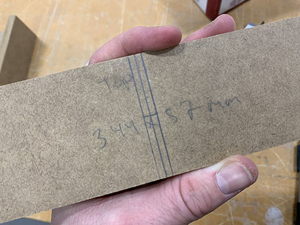
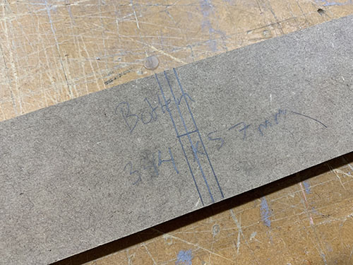
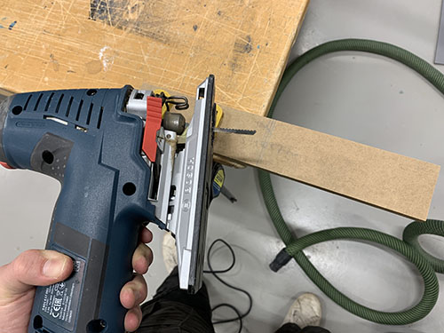
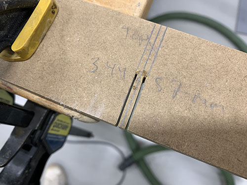
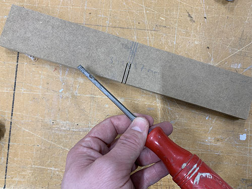
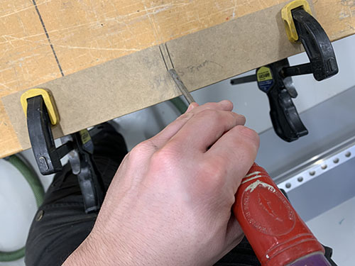
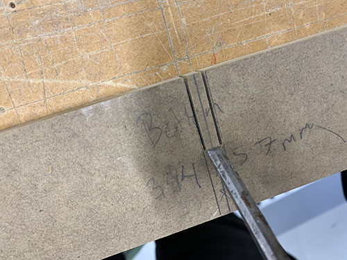
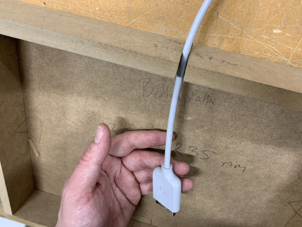

This guide goes through all the steps to build an AI-art installation, using a 
Nvidia Jetson Xavier NX and a Samsung The Frame 32". It includes pre-designed CAD-files,
how to set up the computer to run an art-kiosk (with code), how to build and 
assemble the control box and button etc.

## Table of content
1. [Build control box](#build-the-control-box)
    1. [Hand-cut parts](#hand-cut-parts)
    2. [Cut cable slots](#cut-cable-slots)
    3. [Cut wood biscuits holes](#cut-wood-biscuits-holes)
    4. [Glue parts together](#glue-parts-together)
    5. [Spackling paste and sanding](#spackling-paste-and-sanding)
    6. [Add hinges](#add-hinges)
    7. [Add magnetic lock](#add-magnetic-lock)
2. [Build button box]()
    1. ...
    2. ...
3. [Set up Nvidia Jetson Xavier NX]()
    1. ...
    2. ...
4. [Assemble art installation]()
    1. ...
    2. ...

## Build the control box
To get a nice looking installation with as few visible cables as possible, a control box 
was built to encapsulate the Nvidia computer, power adapters, Samsung One Connect box etc.

### Hand-cut parts
The control box was build using 12mm (0.472") MDF. MDF is quite simple to work with and
looks good when painted. A disadvantage is that it produces very fine-graned
dust when cut or sanded.


A vertical panel saw was used to cut down the MDF into smaller pieces. A table saw was 
used to cut out the final pieces.


| Piece              | Dimensions (width, height)    | Sketch                                                                         |
|--------------------|-------------------------------|--------------------------------------------------------------------------------|
| Bottom base panel  | 320mm x 235mm                 |  |
| Top lid panel      | 344mm x 259mm                 |      |
| Left side panel    | 235mm x 57mm                  |    |
| Right side panel   | 235mm x 57mm                  |   |
| Top side panel     | 344mm x 57mm                  |     |
| Bottom side panel  | 344mm x 57mm                  |  |


### Cut cable slots
To enable the cables to go in and out of the box, two cable slots were cut out:

1. One cable slot in the top side panel for the One Connect cable and button cables.
2. One cable slot in the bottom side panel for the electrical cable.

A caliper was used to measure the diameter of the cables. An extra ~1mm was then added to the slots for
the cables to fit nicely.


The slots were then outlined at the center of the panels.





A jigsaw was used to cut out the slots.





A small chisel and a hammer was used to remove the cut out piece.









### Cut wood biscuits holes
To make the control box robust, wood biscuits were used to glue the parts together. By using wood biscuits, 
no screws were needed, thus giving a nice finish without visible screw heads. It also helps to aligning the
pieces when gluing.

When using the wood biscuit cutter, it's important that the holes end up at the correct place at the 
aligning panels. One simple way of solving this is to align your panels and then draw a line on both 
panels at the center of where you want the biscuit to be. If you do this, the holes will end up at the 
right place.


Before gluing the pieces together, check that the connecting holes are correctly aligning and that all
wood biscuits fit nicely (they can somethings vary a bit in size).


### Glue parts together
When gluing the parts together, you'll need to be fairly quick and structured. Prepare by placing the 
aligning panels next to each other and have all the wood biscuits ready.


Start of by adding the glue in the wood biscuit holes.


Press down the wood biscuits into the holes and apply wood glue along all the connecting parts.


Now, assemble all the connecting parts together and apply force using clamps. You should see
glue seeping out between the panels.


Use an engineer's square to check that you have 90 degrees in each corner of the box.


Finally, remove all the visible redundant glue with a wet paper tissue.


### Spackling paste and sanding
After removing the clamps, there were some visible gaps and cracks that needed to be filled.


I used plastic padding (a two component plastic spackling paste) to cover up the gaps and cracks.


Be careful with how much hardener you add, as it will dry very quickly if adding to much.


When everything had dried, an electric sander was used to remove redundant plastic padding.
The inside of the box was smoothed by manual sanding. As a rule of thumb, if you can
feel an edge or a crack, it will be visible when you paint it.


### Add hinges
The hinges were first added to the lid. It made it easier to align the lid on the box 
later on.

The hinge mortises were measured and outlined. An electric multicutter tool was then used 
to cut out a grid with the same depth as the hinges. The material was then removed using 
a chisel and a hammer. The mortises were then smoothed
by manual sanding.


The hinges were aligned and a bradawl was used to mark the centers of the holes. MDF is a 
very dense material, therefore it's important to pre-drill before screwing the hinges in 
place. If you don't do this, there's a risk that the material will crack.


The depth of the screws were measured and adhesive tape was used to mark the depth
on the drill head. 


Before aligning the hinges on the box, make sure to add some support under the lid,
it should be able to rest at the same level as the box. Double-coated adhesive tape 
was then attached to each hinge and the lid was aligned on top of the box. When the 
lid was correctly aligned, I applied pressure to make the adhesive tape stick.


The hinge holes and the mortises were drilled and cut out in the same way as on
the lid.


### Add magnetic lock
A standard magnetic lock was used to keep the lid in place.


### Milling edges
To give a nice finish, all the edges were milled.


## Set up Nvidia Jetson Xavier NX

### Clone repository
```bash
git clone https://github.com/maxvfischer/Arthur.git
```

### Set up virtual environemnt
Install `venv`:
```bash
sudo apt-get install python3-venv
```

Create environment:
```bash
python3 -m venv venv
```

Activate environment:
```bash
source venv/bin/activate
```

Install `wheel`:
```bash
sudo pip3 install wheel
```

### Install dependencies
```bash
pip3 install -r requirements.txt
```

### Set up user permission
We need to set up user permissions to be able to access the GPIOs.

Create new GPIO user group (remember to change `your_user_name`):
```bash
sudo groupadd -f -r gpio
sudo usermod -a -G gpio your_user_name
```

Copy custom GPIO rules (remember to change `pythonNN`):
```bash
sudo cp venv/lib/pythonNN/site-packages/Jetson/GPIO/99-gpio.rules /etc/udev/rules.d/
```

### Add AI-model checkpoint
Copy the model checkpoint into `arthur/ml/checkpoint`:

    ├── arthur
         ├── ml
             ├── StyleGAN.model-XXXXXXX.data-00000-of-00001
             ├── StyleGAN.model-XXXXXXX.index
             └── StyleGAN.model-XXXXXXX.meta

### Add initial active artwork
Add an initial active artwork image by copying an image here: `arthur/active_artwork.jpg`

### Adjust config.yaml
The config.yaml contains all the settings.

```
active_artwork_file_path: 'active_artwork.jpg'  # Path and name of active artwork

aiartbutton:
  GPIO_mode: 'BOARD'  # GPIO mode
  GPIO_button: 15  # GPIO pinout used for the button
  image_directory: 'images'  # Directory to copy new images from
  button_sleep: 1.0  # Timeout in seconds after button has been pressed

ml_model:
  batch_size: 1  # Latent batch size used when generating images
  img_size: 1024  # Size of generated image (img_size, img_size)
  test_num: 20  # Number of images generated when model is triggered
  checkpoint_directory: 'ml/checkpoint'  # Checkpoint directory
  image_directory: 'images'  # Output directory of generated images
  lower_limit_num_images: 200  # Trigger model if number of images in image_directory is below this value
```
