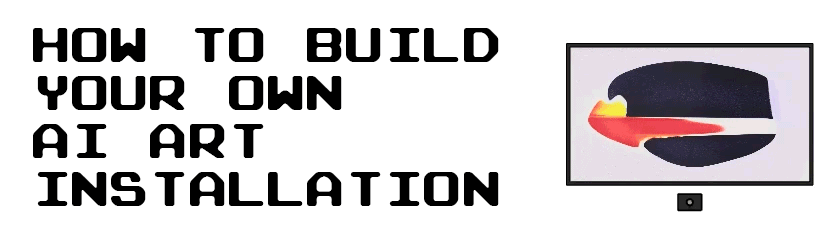

This guide goes through all the steps to build your own AI art installation, using a button to 
change the AI artwork displayed on a screen. The main components used in this guide are:
 
* Nvidia Jetson Xavier NX (GPU-accelerated single-board computer)
* Screen with HDMI support
* Button to change artwork
* Passive infrared sensor to reduce risk of screen burn-in

It includes how to set up the computer to run an art kiosk (with code), how to build and assemble the control 
box, how to integrate the button and PIR sensor etc.

If you have any questions, feel free to contact me on LinkedIn: [https://www.linkedin.com/in/max-fischer-92997281/](https://www.linkedin.com/in/max-fischer-92997281/) 

or


# Table of content
1. [Prepare the computer (Nvidia Jetson Xavier NX Dev Kit)](#prepare-the-computer-(nvidia-jetson-xavier-nx-dev-kit))
    1. [Install operating system](#install-operating-system)
    2. [Install base requirements](#install-base-requirements)
    3. [Install Jetson GPIO](#install-jetson-gpio)
    4. [Install xscreensaver (optional)](#install-xscreensaver-(optional))
    5. [Install Jetson stats (optional)](#install-jetson-stats-(optional))
2. [Install art kiosk](#install-art-kiosk)
3. [Add your generative code](#add-your-generative-code)
    1. [kiosk/arteventhandler.py](#kioskarteventhandlerpy)
    2. [main.py](#mainpy)
4. [Build the control box](#build-the-control-box)
    1. [Hand-cut parts](#hand-cut-parts)
    2. [Cut wood biscuits holes](#cut-wood-biscuits-holes)
    3. [Glue parts together](#glue-parts-together)
    4. [Remove visible gaps](#remove-visible-gaps)
    5. [Add hinges](#add-hinges)
    6. [Add magnetic lock](#add-magnetic-lock)
    7. [Milling edges](#milling-edges)
    8. [Drill PIR sensor hole](#drill-pir-sensor-hole)
    9. [Cut cable slots](#cut-cable-slots)
    10. [Vent holes](#vent-holes)
    11. [Spackling paste and sanding](#spackling-paste-and-sanding)
    12. [Painting](#painting)
5. [Build the button box](#build-the-button-box)
6. [Assemble art installation](#assemble-art-installation)
    1. [Screen](#screen)
    2. [Button box](#button-box)
    3. [Control box](#control-box)
    4. [Electronic components](#electronic-components)
        1. [Main power cable and junction box](#main-power-cable-and-junction-box)
        2. [Samsung One Connect box](#samsung-one-connect-box)
        3. [Nvidia Jetson's power adapter](#nvidia-jetson's-power-adapter)
        4. [Nvidia Jetson](#nvidia-jetson)
        4. [Connect cables](#connect-cables)
        5. [Button](#button)
        6. [PIR sensor](#pir-sensor)
7. [Final AI art installation](#final-ai-art-installation)

# Prepare the computer (Nvidia Jetson Xavier NX Dev Kit)
The Nvidia Jetson Xavier NX Development Kit 
([https://www.nvidia.com/en-us/autonomous-machines/embedded-systems/jetson-xavier-nx/](https://www.nvidia.com/en-us/autonomous-machines/embedded-systems/jetson-xavier-nx/)) is a single-board computer
with an integrated Nvidia Jetson Xavier NX module ([https://developer.nvidia.com/embedded/jetson-xavier-nx](https://developer.nvidia.com/embedded/jetson-xavier-nx)). It's 
developed by Nvidia for running computationally demanding tasks on edge. Similar to the Raspberry Pi, it has 40 GPIO pins that you can
interact with.

The development kit (version US/JP/TW) includes:

* x1 Nvidia Jetson Xavier NX
* x1 19.0V/2.37A power adapter
* x2 Power cables:
    * Plug type I -> C5
    * Plug type B -> C5
* Quick start / Support guide

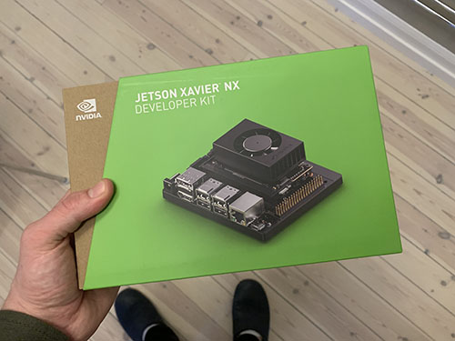

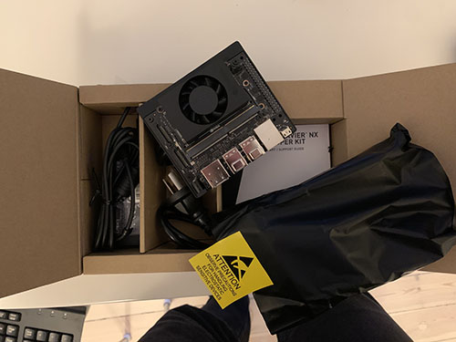

## Install operating system
As the Raspberry Pi, Jetson Xavier is using a micro-SD card as its hard drive. As far as I know, there's only one 
supported OS image (Ubuntu) provided by Nvidia.

To install the OS, you'll need to use a second computer. 

Start of by downloading the OS image: [https://developer.nvidia.com/jetson-nx-developer-kit-sd-card-image](https://developer.nvidia.com/jetson-nx-developer-kit-sd-card-image).
To be able to download it, you need to sign up for a `NVIDIA Developer Program Membership`. It's free and quite useful 
as you'll get access to the Nvidia Developer forum. 

After you've downloaded it, unzip it. 

To flash the OS image to the micro-SD card, start of by inserting the micro-SD card into the second computer and list 
the available disks. Find the disk name of the micro-SD card you just inserted. In my case, it's `/dev/disk2`:


When you've found the name of the micro-SD card, unmount it.


Now, change your current directory to where you downloaded and un-zipped the OS image.


To flash the micro-SD card with the OS image, run the command below. Replace `/dev/disk2` with the disk name of your 
micro-SD card and replace `sd-blob.img` with the name of the un-zipped image you downloaded. I've sped up the 
animation, flashing the card usually takes quite a long time (it took ~55 min @ ~4.6 MB/s for me).


When you're done flashing the micro-SD card with the image, you're ready to boot up the Jetson! Remove the SD-card 
from the second computer and insert it into the Jetson computer. The SD-slot is found under the Xavier NX Module.

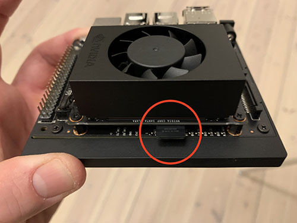

There's no power button, it will boot when you plug in the power cable. After booting and filling in the initial 
system configuration, you should see the Ubuntu desktop.


If you get stuck during boot-up with an output as below, try to reboot the machine.
```bash
[ *** ] (1 of 2) A start job is running for End-user configuration after initial OEM installation...
```

Full installation guide from Nvidia can be found here: 
[https://developer.nvidia.com/embedded/learn/get-started-jetson-xavier-nx-devkit](https://developer.nvidia.com/embedded/learn/get-started-jetson-xavier-nx-devkit)

## Install base requirements
Update and upgrade apt-get

```
sudo apt-get update
sudo apt-get upgrade
```
If asked to choose between `gdm3` and `lightdm`, choose `gdm3`.

Reboot before continuing:

```bash
sudo reboot
```

After reboot, install pip3:

```bash
sudo apt install python3-pip
```

Install virtual environment:

```bash
sudo apt install -y python3-venv
```

Create a virtual environment in the directory `~/venvs` with the name `artkiosk`:

```bash
python3 -m venv ~/venvs/artkiosk
```

Activate the virtual environment:

```bash
source ~/venvs/artkiosk/bin/activate
```

Install python wheel:

```bash
pip3 install wheel
```

## Install Jetson GPIO
[Jetson.GPIO](https://github.com/NVIDIA/jetson-gpio) is a Python package developed by Nvidia that works in the same way
as RPi.GPIO, but for the Jetson family of computers. It enables the user to, through Python code, interact with the GPIO 
pinouts on the Jetson computer.

First, install the Jetson.GPIO package into the virtual environment:

```bash
pip3 install Jetson.GPIO
```

Then, set up user permissions to be able to access the GPIOs. Create a new GPIO user group (replace 
`your_user_name`):

```bash
sudo groupadd -f -r gpio
sudo usermod -a -G gpio your_user_name
```

Copy custom GPIO rules (replace `pythonNN` with your Python version):

```bash
sudo cp venvs/artkiosk/lib/pythonNN/site-packages/Jetson/GPIO/99-gpio.rules /etc/udev/rules.d/
```

Full installation guide can be found here: [https://github.com/NVIDIA/jetson-gpio#installation](https://github.com/NVIDIA/jetson-gpio#installation)

## Install xscreensaver (optional)
To reduce the risk of burn-in when displaying static art on the screen, a PIR (passive infrared) sensor was integrated. 
When no movement has been registered around the art installation, a screen saver was triggered.

The default screen saver on Ubuntu is `gnome-screensaver`. It's not a screen saver in the "traditional sense". Instead of 
showing moving images, it blanks the screen, basically shutting down the HDMI signals to the screen, enabling the screen to fall into low energy mode.

The screen I used in this project was a Samsung The Frame 32" (2020). When the screen was set to HDMI (1/2) and no HDMI 
signal was provided, it showed a static image telling the user that no HDMI signal is found. This is an unwanted behaviour in this set up, as we either 
wants the screen to go blank, or show some kind of a moving image, to reduce the risk of burn-in. We do not want to see 
a new static screen telling us that no hdmi signal is found.

To solve this problem, `xscreensaver` was installed instead. It's an alternative screen saver that support moving 
images. Also, it seems like `xscreensaver's` blank screen mode works differently than `gnome-screensaver`. When 
`xscreensaver's` blank screen is triggered, it doesn't seems to shut down the HDMI signal, but rather turn the screen 
black. This is the behaviour we want in this installation. 

If you're experiencing the same challenge as I did with the screen saver, follow these steps 
to uninstall `gnome-screensaver` and install `xscreensaver`:

```bash
sudo apt-get remove gnome-screensaver
sudo apt-get install xscreensaver xscreensaver-data-extra xscreensaver-gl-extra
```
After uninstalling `gnome-screensaver` and installing `xscreensaver`, it was added to `Startup Applications`:


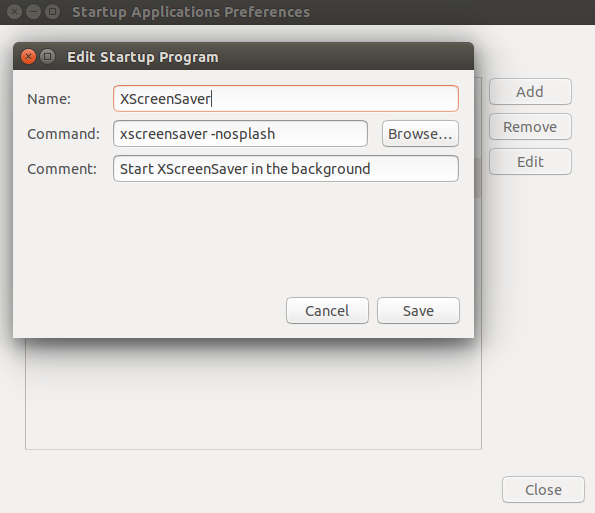


Full installation guide: [https://askubuntu.com/questions/292995/configure-screensaver-in-ubuntu/293014#293014](https://askubuntu.com/questions/292995/configure-screensaver-in-ubuntu/293014#293014)

## Install Jetson stats (optional)
[Jetson stats](https://github.com/rbonghi/jetson_stats) is a really useful open-source package to monitor and control 
the Jetson. It enables you to track CPU/GPU/Memory usage, check temperatures, increase the swap memory etc.

To install Jetson stats:

```bash
sudo -H pip install -U jetson-stats
```

Reboot your machine:

```bash
sudo reboot
```

Activate the virtual environment again after reboot:

```bash
source ~/venvs/artkiosk/bin/activate
```

To check CPU/GPU/Memory usage etc:

```bash
jtop
```

Full list of commands can be found here: [https://github.com/rbonghi/jetson_stats](https://github.com/rbonghi/jetson_stats)

# Install art kiosk
We're now ready to install the art kiosk on the computer! 

Start by clone this repository:

```bash
git clone https://github.com/maxvfischer/DIY-ai-art.git
```

Change active directory and install the dependencies:

```bash
cd DIY-ai-art
pip3 install -r requirements.txt
```

The art kiosk is started by executing:

```bash
python3 -m main
```

NOTE: The art kiosk will **NOT** work properly if you don't attach the button and the PIR sensor. Please continue to 
follow the instructions.

The program running the art kiosk is written in `Python` 
and is running as 4 parallel processes, each implemented as its own class: `Kiosk`, `ArtButton`, `PIRSensorScreensaver` 
and `GANEventHandler`. The entry point is `main.py` and all the parameters used are defined in `config.yaml` (e.g. path to 
image directory, GPIO pinouts used etc).

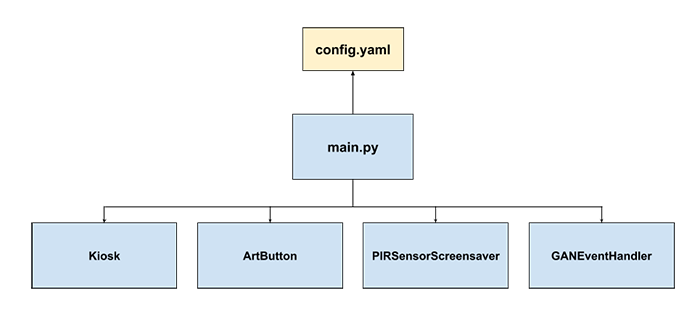

| **Process/Class**              | **File**                   | **Description**                                                                                                                                                                                                                                                                                                                                                                                      |
|--------------------------------|----------------------------|------------------------------------------------------------------------------------------------------------------------------------------------------------------------------------------------------------------------------------------------------------------------------------------------------------------------------------------------------------------------------------------------------|
| **Kiosk**                      | kiosk/kiosk.py             |The `Kiosk` process handles all the GUI: toggling (\<F11>) and ending (\<Escape>) fullscreen, listens to change of the active artwork to be displayed etc.                                                                                                                                                                                                                                            |
| **ArtButton**                  | kiosk/artbutton.py         |The `ArtButton` process listens to a GPIO pinout connected to a button. When the button is pushed and the GPIO is triggered, it replaces the active artwork file with a random image sampled from the image directory.                                                                                                   |
| **PIRSensorScreensaver**       | kiosk/pirsensorscreensaver |The `PIRSensorScreensaver` process listens to a GPIO pinout connected to a PIR sensor. When no motion has triggered the PIR sensor within a predefined threshold of seconds, the computer's screensaver is activated. When motion is detected, the screensaver is deactivated.                                              |
| **ArtEventHandler**            | kiosk/art_event_handler.py             |The `ArtEventHandler` process is listening to deleted items in the image directory. When the button is clicked and an image is deleted (i.e. moved to replace the active artwork file, active_artwork.jpg), this process checks how many images that are left in the image directory. If the number of images falls are below a predefined threshold, a new process (function) is spawned, generating a new set of images. You need to update this class to generate the images. |

# Add your generative code
You need to add your own generative code (GAN-network or others), by updating two files:

* kiosk/arteventhandler.py
* main.py

## kiosk/arteventhandler.py
The class `ArtEventHandler` found in the file `kiosk/arteventhandler.py` is an event handler that is triggered to generate new images to be saved in the image directory. When an image is deleted from the image directory (i.e. moved to replace the active artwork), `ArtEventHandler's` class function `on_deleted` is executed. It checks if the number of images found in the image directory is above or below a pre-defined threshold. If the number of images falls below the threshold, `ArtEventHandler's` class function `generate_images` is executed. It is in this function that you need to add your generative code that will add new images to the image directory.

## main.py
If you have updated `ArtEventHandler's` constructor with new arguments, you need to update the initialization of `ArtEventHandler` in the function `start_art_generator` found in `main.py`.

# Build the control box
To get a nice looking installation with as few visible cables as possible, a control box was built to encapsulate the Nvidia computer, power adapters, Samsung One Connect box etc.

## Hand-cut parts
The control box was build using 12mm (0.472") MDF. A vertical panel saw was used to cut down the MDF into smaller pieces. A table saw was used to cut out the final pieces.

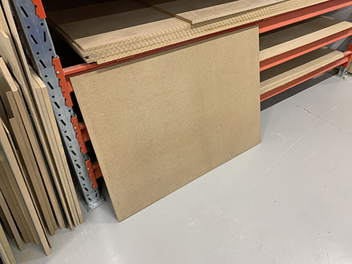

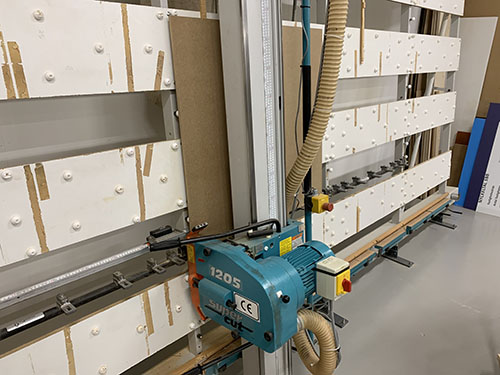

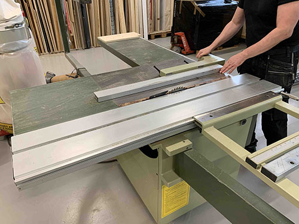

| Piece              | Dimensions (width, height)    | Sketch                                                                         |
|--------------------|-------------------------------|--------------------------------------------------------------------------------|
| Bottom base panel  | 320mm x 235mm                 | 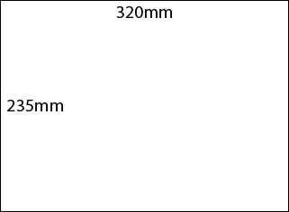 |
| Top lid panel      | 344mm x 259mm                 | 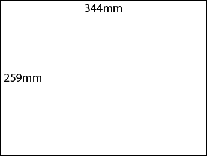     |
| Left side panel    | 235mm x 57mm                  |    |
| Right side panel   | 235mm x 57mm                  | 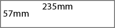  |
| Top side panel     | 344mm x 57mm                  |     |
| Bottom side panel  | 344mm x 57mm                  | 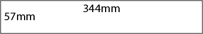 |

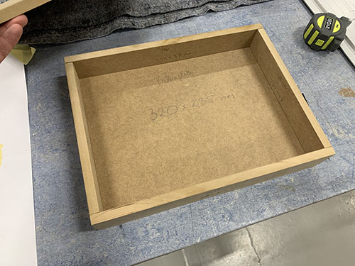

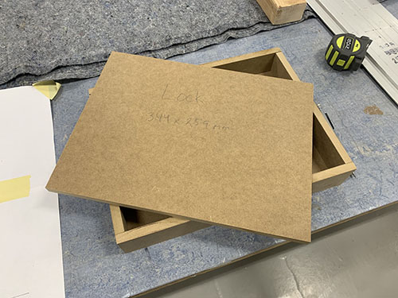

## Cut wood biscuits holes
To make the control box robust, wood biscuits were used to glue the parts together. By using wood biscuits, 
no screws were needed, thus giving a nice finish without visible screw heads. It also helps to aligning the
pieces when gluing.

When using the wood biscuit cutter, it's important that the holes end up at the correct place at the 
aligning panels. One simple way of solving this is to align your panels and then draw a line on both 
panels at the center of where you want the biscuit to be. If you do this, the holes will end up at the 
right place.

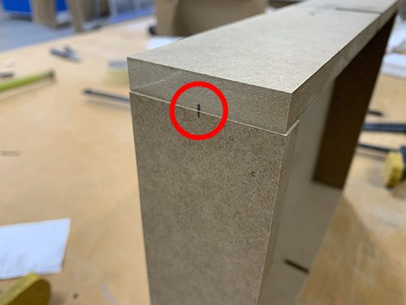

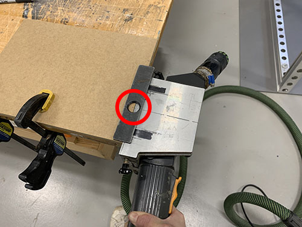

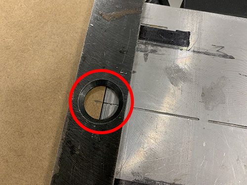

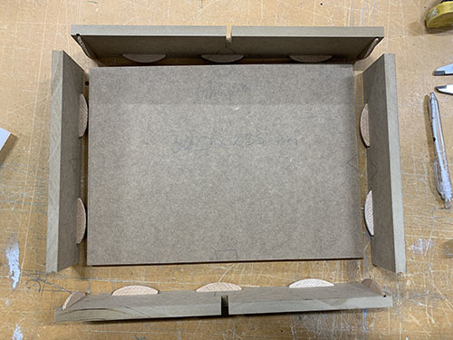

Before gluing the pieces together, check that the connecting holes are correctly aligning and that all
wood biscuits fit nicely (they can somethings vary a bit in size).

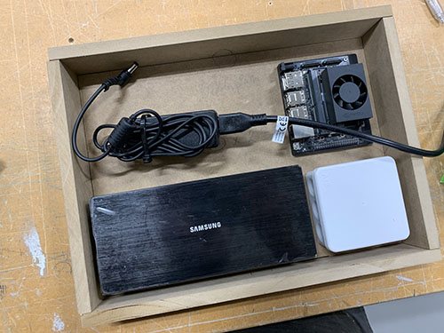

## Glue parts together
When gluing the parts together, you'll need to be fairly quick and structured. Prepare by placing the 
aligning panels next to each other and have all the wood biscuits ready.

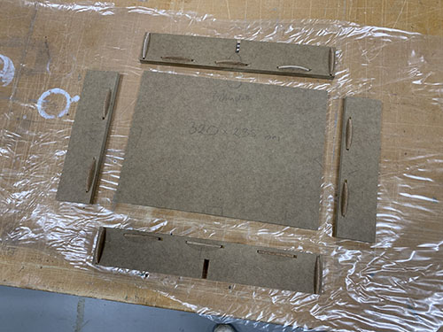

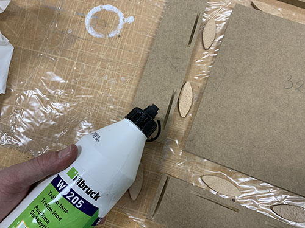

Start of by adding the glue in the wood biscuit holes.

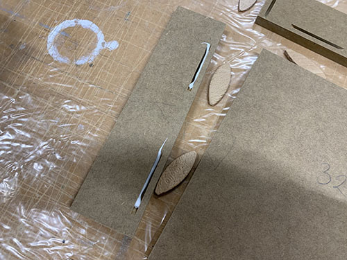

Then, press down the wood biscuits into the holes and apply wood glue along all the connecting parts.

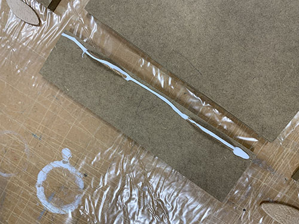

Now, assemble all the connecting parts and apply force using clamps. You should see
glue seeping out between the panels.

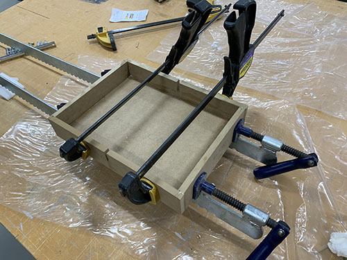

Use an engineer's square to check each corner.

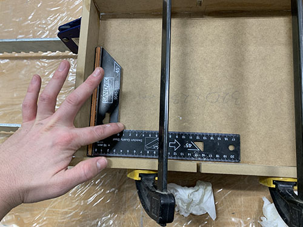

Finally, remove all the visible redundant glue with a wet paper tissue.

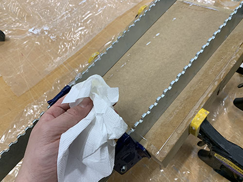

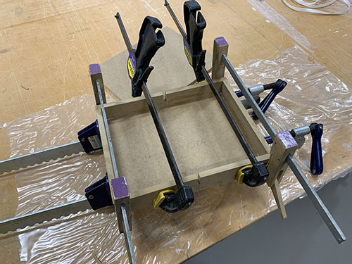

## Remove visible gaps
After removing the clamps, there were some visible gaps and cracks that needed to be filled.

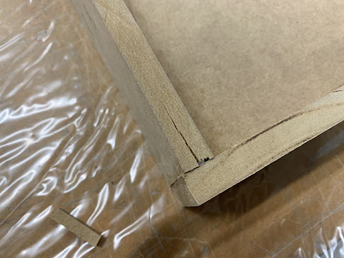

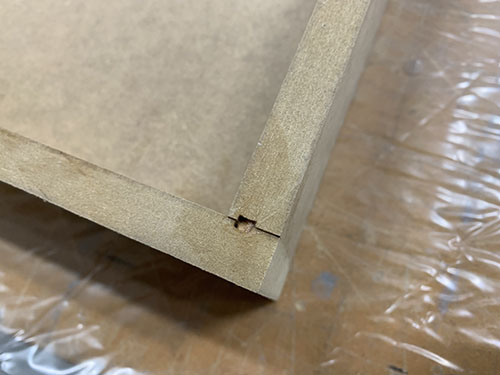

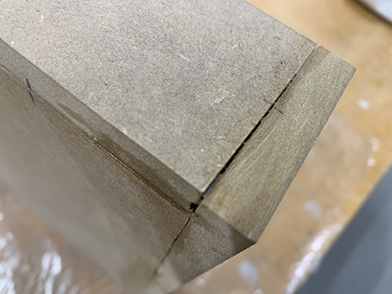

I used plastic padding (a two component plastic spackling paste) to cover up the gaps and cracks. Be careful with how 
much hardener you add, as it will dry very quickly if adding too much.


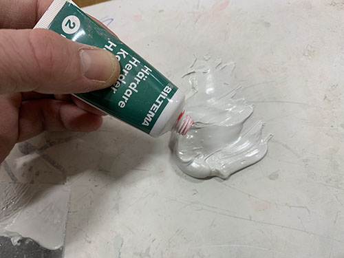

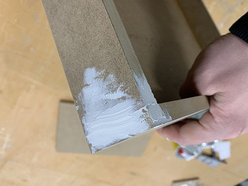

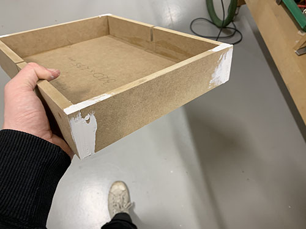

When everything had dried, an electric sander was used to remove redundant plastic padding.
The inside of the box was smoothed by manual sanding. As a rule of thumb, if you can
feel an edge or a crack, it will be visible when painted.

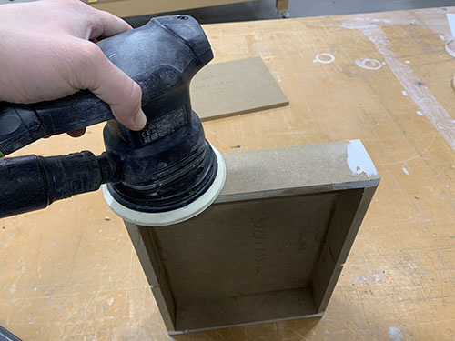

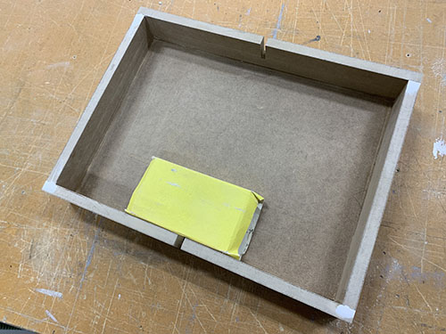

## Add hinges
The hinges were first added to the lid. It made it easier to align the lid on top of the box 
later on.

The hinge mortises were measured and outlined. An electric multicutter tool was then used 
to cut out a grid with the same depth as the hinges. The material was then removed using 
a chisel and a hammer. The mortises were then smoothed
by manual sanding.

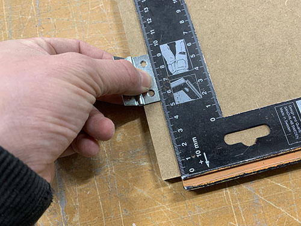


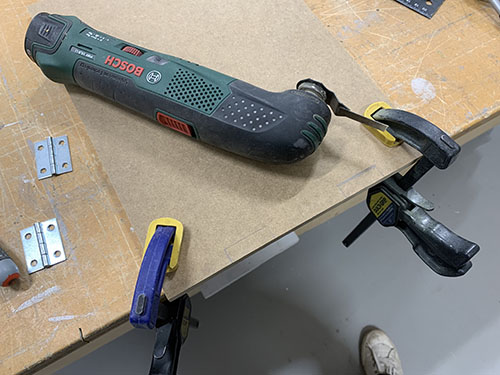

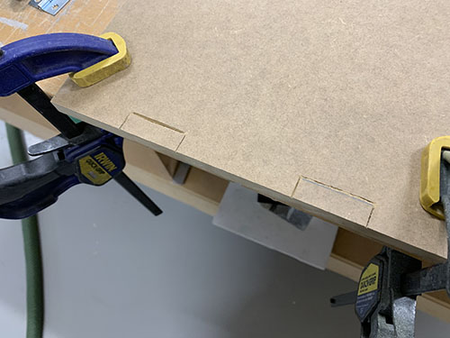

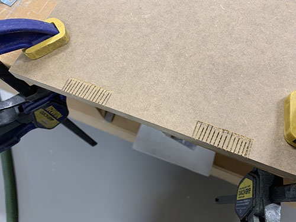

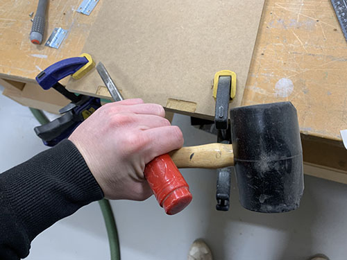

The hinges were aligned and a bradawl was used to mark the centers of the holes. MDF is a 
very dense material, therefore it's important to pre-drill before screwing the hinges in 
place. If you don't do this, there's a high risk that the material will crack.


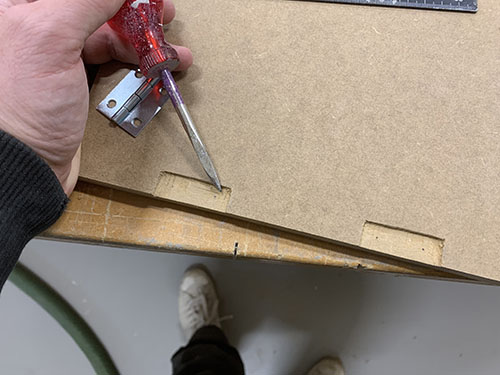

The depth of the screws were measured and adhesive tape was used to mark the depth
on the drill head. 

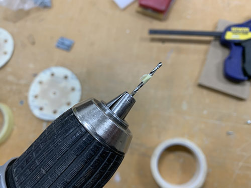

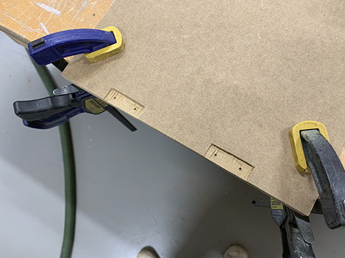

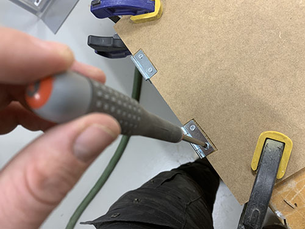

Before aligning the hinges on the box, make sure to add some support under the lid,
it should be able to rest at the same level as the control box. Double-coated adhesive tape 
was then attached to each hinge and the lid was aligned on top of the box. When the 
lid was correctly aligned, pressure was applied to make the adhesive tape stick.

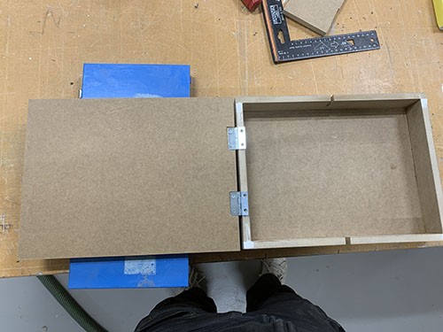

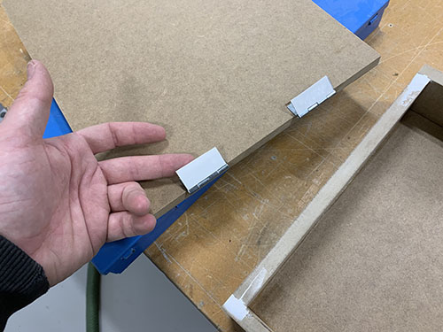

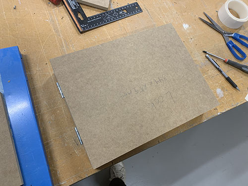

The hinge holes and the mortises were drilled and cut out in the same way as on
the lid.


## Add magnetic lock
A magnetic lock was used to keep the lid in place.


## Milling edges
All the edges were rounded using a handheld milling machine.


## Drill PIR sensor hole
To integrate the PIR sensor, the control box was disassembled. A hole was 
then measured, aligned and drilled all the way through the lid to enable 
the PIR reflector to stick out. A larger drill with the same diameter as the 
sensor chip was then used to carefully extend the slot from the inside of the lid. 
The extended hole was not drilled all the way through, approximately 2 mm was 
left for the sensor chip to rest on. Finally, a sand paper was used to manually 
sand the edges for a perfect fit.


## Cut cable slots
To enable the cables to go in and out of the box, two cable slots were cut out:

1. One cable slot in the top side panel for the One Connect cable and button cables.
2. One cable slot in the bottom side panel for the electrical cable.

Initially, the cable slots were only cut half way through the top and bottom panels. 
But I then realized (after I had assembled and painted everything ¯\\(ツ)/¯), that it will look much better if I cut the 
cable slots all the way through and then glue a piece of MDF into the hole to cover up the redundant space. That's why 
the control box is painted in the images below.

A caliper was used to measure the diameter of the cables. An extra ~1mm was then added to the slots for the cables to fit nicely. But in hindsight I would've extended the slot 2-3 mm more.


The slots were then outlined at the center of the top and bottom panels. The outlines were also extended approximately 
15 mm into the back panel. A Japanese hand saw/Dozuki saw was used to cut out the slots. A small chisel and a hammer was used to remove the cut out pieces.


A hole saw was used to extract a larger hole in the top of the back panel, connected to the top panel's cable slot. It 
enabled the One Connect Cable to be inserted.


Pieces of MDF with the same width and height as the cable slots were cut out. Sand paper was used to do small 
adjustments. The cables were then inserted into the slots and the MDF pieces were aligned and cut to give just enought 
space for the cables to fit.


Wood glue were applied and smeared out on the connecting parts. The MDF pieces were then squeezed 
into the slots.


## Vent holes
Vent holes were drilled in the bottom and the top panel to enable heat to flow out of the control box.


## Spackling paste and sanding
Plastic padding were used cover the cracks between the cables slots and the glued MDF pieces. The control box was then 
manually sanded to remove the redundant plastic padding and round the edges around the vent holes etc. 


## Painting
The control box was painted in the same color as the wall it was attached to. A tip is to buy a color sample can 
instead of a full can. You will not need a full can, and the sample cans are usually cheaper per litre.

A paint roller was used on the flat areas and a small brush was used to paint the smaller details.


After the paint had dried, everything was reassembled.


# Build the button box
A modified black plastic enclosure box was used as a button box. To integrate the 
button, the vertical and horizontal center was first measured and pre-drilled. Then, 
a hole with the diameter of the button was drilled.


As the button box will be located between the control box and the screen, the two 
button cables and the One Connect cable (bringing electricity and HDMI to the screen) 
will enter the button box at the bottom. The One Connect cable will also exit 
the button box at the top (continuing to the TV). Two cable slots were therefore extracted at the top
and the bottom, using a Japanese hand saw/Dozuki saw. The slots were then smoothed
by manual sanding.


The screws keeping the enclosure box together were colored black using an aerosol varnish paint. A tip
when painting screws is to stick them into a piece of styrofoam.


# Assemble art installation
The art installation was now ready to be assembled and attached to the wall. A cross line laser was used to vertically align the screen, button box and control box. 

## Screen
The screen (Samsung The Frame 32" 2020) was wall-mounted following the instructions included when buying the screen.


## Button box
Two screw holes were drilled in the bottom plate of the button box. Double-coated adhesive tape was also attached
to the back side of the bottom plate for further support. The button box was then aligned using the laser and
attached to the wall using two wall plugs, the two screws and the double-coated adhesive tape.


## Control box
The control box was attached to the wall using wall plug and two screws. To be able to outline the screw holes, all the electronics were temporarily placed in the control box and two screw holes were outlined and drilled. The HDMI/One Connect
cable were then inserted into the cable slot and the control box was attached to the wall. 


## Electronic components

**NOTE: THIS PART INCLUDES WIRING OF HIGH VOLTAGE ELECTRICITY THAT CAN BE
LETHAL IF NOT DONE PROPERLY. THE COLORS OF THE CABLES CAN VARY DEPENDING ON 
REGION/COUNTRY. BEFORE YOU CONNECT THE POWER CORD TO THE POWER OUTLET, CONSULT WITH A LICENSED ELECTRICIAN TO MAKE SURE THAT EVERYTHING IS PROPERLY WIRED 
AND THAT IT IS IN LINE WITH YOUR LOCAL LEGISLATIONS.**


### Main power cable and junction box

The female side of the main power cord was removed and the cable was inserted
into the control box. A junction box was then attach in the bottom right 
corner using velcro tape. Before the velcro tape was attached, the backside of the junction box was cleaned with denatured alcohol. Three holes were created in the side of the junction box to enable three cables to enter.


A wire stripper was used to strip the jacket/insulation of the power cord, 
as well as the wires inside. A splicing connector (Wago 221, 3-conductor) was then 
attached to each wire, enabling electricity from a single power outlet to be 
split to the One Connect Box and to the Nvidia Jetson Xavier NX, without using 
a power strip.


### Samsung One Connect box

The Samsung One Connect box was then attached in the left bottom corner using
velcro tape. Some margin was left below and to the left of the One Connect box for the power cord and for the PIR sensor cables. Also, the backside of the One Connect Box was cleaned using denatured alcohol before attaching the velcro tape. 


The screen's power cord (IEC C7 coupler) was inserted into the One Connect 
Box. It was then aligned, measured and cut at an appropriate length to reach 
inside the junction box. The wire stripper was used to remove the jacket/insulation of the power cord, as well as the wires inside. The C7 cable was 
then inserted into the junction box and connected to the splicing connectors. 
The ground was left out as the C7 coupler is ungrounded.


### Nvidia Jetson's power adapter

The power adapter to the Nvidia Jetson Xavier NX was attached in the top left 
corner using velcro tape. The power cord (IEC C5 coupler) was inserted 
into the power adapter. It was then aligned, measured and cut at an appropriate 
length to reach inside the junction box. The wire stripper was used to remove 
the jacket/insulation of the power cord, as well as the wires inside. The C5 
cable was then inserted into the junction box and connected to the splicing 
connectors.


Before closing the junction box, cable ties were tightened around each cable 
going into the junction box as strain reliefs.


### Nvidia Jetson

To attach the Nvidia Jetson, two pieces of galvanised band was cut out and wrapped 
in insulating tape. The computer was then attached in the top right corner 
using 4 small screws and washers.


### Connect cables

The HDMI, the One Connect Cable and the Xavier NX power cable were connected. 
Cable ties were used to structure the cables.


### Button

The button changing the artwork was implemented as a pull-up resistor. When the button is "off" (i.e. not pushed), a small current will flow from the positive 3.3v, through the resistor and into the GPIO pin, leading to the GPIO pin being HIGH (1). On the other hand, when the button is pushed, the current will flow from the positive 3.3v, through the resistor, via the button and into ground (GND). This will lead to the GPIO pin being LOW (0). This shift in HIGH/LOW on the GPIO pin is registered in the code and is used to change the artwork on the screen. The schema for the pull-up resistor can be found below.


Two cables were measured and soldered to the button. The cables were then 
inserted into the control box via the same cable slot as the One Connect cable. 
Make sure that you have enough cable to reach to the Nvidia Jetson computer.


The end of a female jumping wire were then soldered to the end of the cable 
connecting to the ground (for being able to unplug the cable easily). Before 
soldering the two cables together, one of the cables were passed through a 
shrinking tube. After the cables were soldered together, a blow torch was used 
to shrink the tube around the soldering.


A 1kΩ resistor and a female jumping wire were soldered to the other button 
cable. Finally, another female jumping cable were soldered to the other side of 
the resistor.


The jumping wires were then connected to the following Nvidia Jetson GPIOs:

* Blue: Ground (pin 14)
* Red: 3.3v (pin 17)
* Green: GPIO (pin 15)


The Samsung One Connect cable were finally inserted through the button box and the button box's top plate was attached.


A cable channel was attached to the wall between the button box and the control box using double-coated adhesive tape, fitting the button cables and the One Connect cable. Before it was painted, the cable channel was manually sanded to make a better grip for the color. A primer was then added, followed by two layers of wall paint.


### PIR sensor

Three cables of equal length were measured and cut out (I would've preferred 
to have three different colors, but I only had black and red cable).


Three female/female jumping wires were then cut in the middle and soldered 
to the three cables, one set of jumping wires for each cable. To compensate for the bad coloring of the main cables, three different colors were chosen for the 
jumping wires.

Multiple larger shrinking tubes were used to keep the three cables together.


The PIR sensor I used was a SR602. It has three pinouts that were connected to the Nvidia Jetson:

* **\-** to GND (pin 6)
* **\+** to 3.3v (pin 1)
* **out** to a GPIO (pin 7)


When the PIR sensor register a person walking by, **out** will be HIGH. When 
there's no detection, **out** will be LOW.

The PIR sensor were then inserted into its slot in the control box lid.


# Final AI art installation


